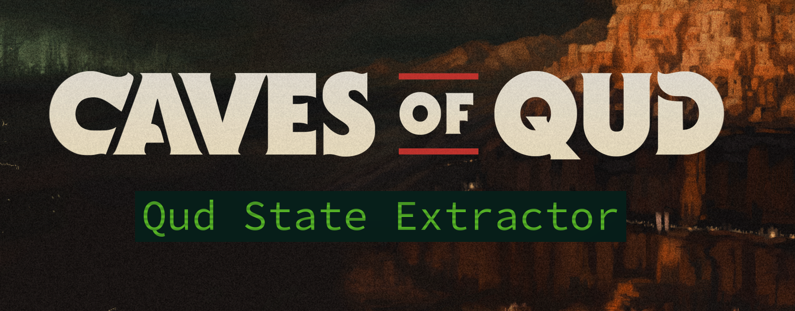

[](https://learn.microsoft.com/en-us/dotnet/)
[](https://learn.microsoft.com/en-us/dotnet/csharp/tour-of-csharp/overview)
[](https://kernel.org)
[](#dependencies)
[](https://github.com/piestyx/game-mods/commits/main/)
[](#setup)
[](#license)

# Qud State Extractor

**Game Website**: [Caves of Qud](https://www.cavesofqud.com/)  
**Official Twitter/X**: [@cavesofqud](https://x.com/cavesofqud)

## Quickstart

```bash
git clone https://github.com/piestyx/game-mods.git
cd QudStateExtractor
cp .env.template .env
# Edit .env to choose your output directory
bash build.sh
```

* Then drop the `.cs` files and `mod.json` into your Qud `Mods/` folder.

---

## Overview

Qud State Extractor is an advanced Harmony-based mod for Caves of Qud that logs all in-game player messages, player state, and world state to disc in plaintext and JSON formats.

Ideal for AI-driven gameplay automation, narrative streaming, sandboxing, or gameplay data analysis.

---

## Note

Caves of Qud compiles the mod to a separate `ModAssemblies/` folder, so any runtime use of `Assembly.GetExecutingAssembly().Location` points to the wrong directory. To fix this:

* `EnvHelper.cs` assumes the `.env` file lives in the mod’s root install directory (e.g. `~/.config/unity3d/.../Mods/QudLogExporter`)
* It loads environment variables from `.env` during game launch
* Paths like `${HOME}` are resolved to the local environment

This design avoids hardcoded user paths and hopefully keeps the mod portable across machines and distros.

---

## Features

* Logs all player-facing messages to `message_log.txt`
* Dumps state snapshots:

  | File               | Contents                                                                             |
  | ------------------ | ------------------------------------------------------------------------------------ |
  | `agent_state.json` | Player HP, inventory, effects, position, stats, mutations, abilities, factions, time |
  | `world_state.json` | Current zone, terrain, visible entities (grouped & detailed), weather                |
  | `message_log.txt`  | Timestamped narrative log                                                            |

Additional highlights:
  - Cosmetic entities are grouped by type & count
  - Fully configurable paths in .env
  - Resets log file if it exceeds a configured size
  - Toggle verbose Unity debug logging

---

## How It Works

Hooks into:

```csharp
XRL.Messages.MessageQueue\:AddPlayerMessage(string message, string color, bool capitalize)
```

And writes to paths defined in your `.env`:

```dotenv
BASE_FILE_PATH=${HOME}/.config/unity3d/Freehold Games/CavesOfQud/StateLogs/
AGENT_FILE_PATH=${BASE_FILE_PATH}agent_state.json
WORLD_FILE_PATH=${BASE_FILE_PATH}world_state.json
```

---

## Dependencies

| Dependency      | Purpose                                   | Notes                 |
| --------------- | ----------------------------------------- | --------------------- |
| `mono-complete` | Required to compile with `mono-csc`       | Linux only            |
| `Harmony`       | Patch engine for runtime method overrides | Qud already ships it  |
| `UnityEngine.*` | Game interface layer                      | Needed for build only |

---

## Setup

1. Place the mod in your Qud Mods folder:

   ```bash
   ~/.config/unity3d/Freehold\ Games/CavesOfQud/Mods/QudStateExtractor
   ```

2. Copy and edit the environment template:

   ```bash
   cp .env.template .env
   ```

3. Example `.env`:

```dotenv
# Required path for output files
BASE_FILE_PATH=${HOME}/.config/unity3d/Freehold Games/CavesOfQud/StateLogs/
AGENT_FILE_PATH=${BASE_FILE_PATH}agent_state.json
WORLD_FILE_PATH=${BASE_FILE_PATH}world_state.json

# Optional maximum file size (in bytes) before logs reset
LOG_FILE_MAX_SIZE=1048576

# Enable or disable Unity debug logs
ENABLE_VERBOSE_LOGS=true
```

> Use `${HOME}` for cross-system compatibility.

---

## Compiling the Mod

You only need to compile if you want a `.dll` instead of using `.cs` source files.

Use the included build script after replacing the path values in the script:

```bash
mono-csc -target:library -out:ModAssemblies/QudLogExporter.dll \
  -reference:"/path/to/CavesOfQud/CoQ_Data/Managed/Assembly-CSharp.dll" \
  -reference:"/path/to/CavesOfQud/CoQ_Data/Managed/0Harmony.dll" \
  -reference:"/path/to/CavesOfQud/CoQ_Data/Managed/UnityEngine.CoreModule.dll" \
  -reference:"/usr/lib/mono/4.8-api/Facades/netstandard.dll" \
```

```bash
bash build.sh
```

---

## Usage

1. Enable the mod in the Qud **Mods** menu
2. Start a game
3. Logs will appear at the path set in your `.env`

---

## Sample Output

### `message_log.txt`

```
[21:54:40] You see a {{B|{{W|wet}} {{B|snapjaw warrior}}}} to the northwest and stop moving.
[21:54:42] {{&R|You begin bleeding!}}
[21:54:44] &yYou died.
```

### `agent_state.json`

```json
{
  "hp": { "current": 16, "max": 18, "penalty": 0 },
  "inventory": [ ... ],
  "status_effects": [ ... ],
  "position": { "x": 37, "y": 22 },
  "stats": { ... },
  "mutations": [ ... ],
  "abilities": [ ... ],
  "factions": [ ... ],
  "time_ticks": 367526
}
```

### `world_state.json`

```json
{
  "zone": { "name": "Sararuk", "zone_id": "JoppaWorld.7.22.1.1.10", "position": { "x": 1, "y": 1, "z": 10 } },
  "terrain": { "name": "salt dunes", "blueprint": "TerrainSaltDunes", "tags": [ ... ], "region": "Saltmarsh" },
  "entities": [ ... ],
  "cosmetic_entities": [ { "name": "dirt path", "count": 12 }, ... ],
  "weather": { "has_weather": true, "current_wind_direction": "N", ... }
}
```

---

## Limitations

* Only logs messages sent via `AddPlayerMessage`
* `.env` must exist and be correctly formatted
* The mod doesn't auto-create folders so all output directories must exist
* Currently Linux-only (Windows support untested)

---

## Roadmap

* [ ] Pretty-print JSON for debugging readability
* [ ] Zone-based sharding of log output
* [ ] Performance optimisations for frequent writes
* [ ] Windows path support

---

## License

MIT-style. Fork it, adapt it, use it.

> Created by: **piestyx**
> First released: **2025-07-12**