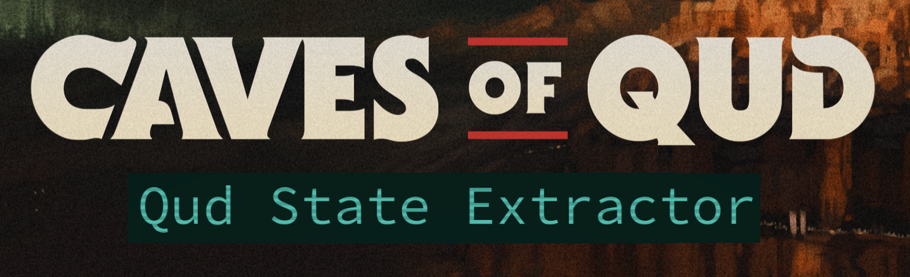

[](https://learn.microsoft.com/en-us/dotnet/)
[](https://learn.microsoft.com/en-us/dotnet/csharp/tour-of-csharp/overview)
[](https://kernel.org)
[](#dependencies)
[](https://github.com/piestyx/game-mods/commits/main/)
[](#setup)
[](#license)

# Qud State Extractor

**Game Website**: [Caves of Qud](https://www.cavesofqud.com/)  
**Official Twitter/X**: [@cavesofqud](https://x.com/cavesofqud)

## Quickstart

```bash
git clone https://github.com/piestyx/game-mods.git
cd game-mods/caves-of-qud/QudStateExtractor
cp .env.template .env
# Edit .env to choose your output directory
bash build.sh
```

* Then drop the `.cs` files and `mod.json` into your Qud `Mods/` folder.

---

## Overview

**Qud State Extractor** is a comprehensive Harmony-based mod for *Caves of Qud* that exports complete game state information to JSON files in real-time. Originally designed for AI-driven gameplay and streaming enhancements, it provides full visibility into player state, world state, UI screens, and available actions with their keyboard shortcuts.

Unlike simple message loggers, this mod captures:
- **What the player can see** (world state, nearby items, UI screens)
- **What actions are available** (menu options, abilities, trade offers)
- **How to perform actions** (keyboard shortcuts and hotkeys)
- **Current game context** (quests, dialogue, equipment, stats)

This makes it ideal for:
- AI agents that need to understand and play the game
- Accessibility tools that need structured game data
- Analytics and gameplay research
- Enhanced streaming overlays
- Custom UI development

---

## Architecture Note

Caves of Qud compiles mods to `ModAssemblies/`, so `Assembly.GetExecutingAssembly().Location` points to the wrong directory. To solve this:

* `EnvHelper.cs` locates the mod's root directory by walking up from `ModAssemblies/`
* Environment variables are loaded from `.env` in the mod root
* Paths support `${HOME}` and `${VARIABLE}` expansion for portability

This design keeps the mod portable across machines without hardcoded paths.

---

## Features

### Core Exports (17 Data Streams)

All exports include timestamps, proper source tracking, and Qud markup preservation where needed.

#### Gameplay State
* **`message_log.txt`**: Timestamped stream of all in-game messages
* **`agent_state.json`**: Player HP, stats, inventory, equipped items, mutations, skills
* **`world_state.json`**: Current zone, visible entities (hostile/neutral), terrain, weather
* **`quests.json`**: Active quests with objectives, steps, and completion status
* **`journal.json`**: Sultan histories, lore notes, and discoveries
* **`points_of_interest.json`**: Notable locations and landmarks

#### UI & Interaction State
* **`dialogue.json`**: Current conversation with speaker, text, and choice options
* **`ui_popup.json`**: Active popup messages and prompts
* **`nearby_items.json`**: Items visible on screen with take/examine options

#### Menu Screens (with hotkeys and bottom bars)
* **`ability_menu.json`**: All abilities with activation keys and cooldowns
* **`equipment_screen.json`**: Equipped items by slot with quick-swap keys
* **`skills_powers.json`**: Character skills and mutations with point costs
* **`status_screen.json`**: Detailed character stats and attributes
* **`tinkering_screen.json`**: Crafting recipes and material requirements
* **`pick_item.json`**: Item selection interface with quickkeys
* **`trade.json`**: Trade screen with item prices and available actions
* **`trade_completion.json`**: Completed trade results with items exchanged

### Key Features
* **Complete UI State**: Every menu includes bottom bar options with keyboard shortcuts
* **Hotkey Mapping**: Automatic extraction of quickkeys (a-z, 0-9) for items and options
* **Trade Information**: Full pricing data, value calculations, and cost multipliers
* **Real-time Updates**: Exports trigger on relevant game events for timely data
* **Performance Optimized**: Smart caching and event filtering minimize overhead
* **Configurable Paths**: All output locations defined in `.env`
* **Debug Mode**: Optional verbose logging for troubleshooting

---

## How It Works

### Message Logging
Hooks into `XRL.Messages.MessageQueue:AddPlayerMessage` to capture all player-facing messages with timestamps.

### State Exports
Triggered by relevant in-game events to ensure timely updates without excessive polling:

**Core State Events:**
- `ObjectAddedToPlayerInventory` / `PerformDrop` → inventory updates
- `SyncMutationLevels` → mutation/skill changes
- `BeforeCooldownActivatedAbility` → ability usage
- `AccomplishmentAdded` → quest/achievement updates
- `GetPointsOfInterest` → world exploration
- `AIWakeupBroadcast` → combat state changes

**UI State Events:**
- Menu open/close → screen state exports
- Item selection → pick item state
- Trade updates → trade screen state
- Dialogue changes → conversation state

### Bottom Bar Scraping
Every menu screen exports its bottom bar showing:
- Available commands ("Close Menu", "navigate", "take all")
- Keyboard shortcuts (Escape, arrows, hotkeys)
- Context-specific actions (trade, store, examine)

This allows AI agents to know exactly what actions are possible at any moment.

---

## Dependencies

| Dependency      | Purpose                                   | Notes                 |
|-----------------|-------------------------------------------|-----------------------|
| `mono-complete` | Required to compile with `mono-csc`       | Linux only            |
| `Harmony`       | Patch engine for runtime method overrides | Qud already ships it  |
| `UnityEngine.*` | Game interface layer                      | Needed for build only |

---

## Setup

1. Place the mod in your Qud Mods folder:
   ```bash
   ~/.config/unity3d/Freehold\ Games/CavesOfQud/Mods/QudStateExtractor
   ```

2. Copy and edit the environment template:
   ```bash
   cp .env.template .env
   ```

3. Example `.env`:
   ```dotenv
   # Base path for all output files
   BASE_FILE_PATH=${HOME}/.config/unity3d/Freehold Games/CavesOfQud/StateLogs/
   
   # Individual file paths (all support ${BASE_FILE_PATH} expansion)
   AGENT_FILE_PATH=${BASE_FILE_PATH}agent_state.json
   WORLD_FILE_PATH=${BASE_FILE_PATH}world_state.json
   QUESTS_FILE_PATH=${BASE_FILE_PATH}quests.json
   DIALOGUE_FILE_PATH=${BASE_FILE_PATH}dialogue.json
   JOURNAL_FILE_PATH=${BASE_FILE_PATH}journal.json
   MESSAGE_LOG_FILE_PATH=${BASE_FILE_PATH}message_log.txt
   POINTS_FILE_PATH=${BASE_FILE_PATH}points_of_interest.json
   POPUP_FILE_PATH=${BASE_FILE_PATH}ui_popup.json
   ABILITY_MENU=${BASE_FILE_PATH}ability_menu.json
   EQUIPMENT_SCREEN=${BASE_FILE_PATH}equipment_screen.json
   SKILLS_POWERS=${BASE_FILE_PATH}skills_powers.json
   STATUS_SCREEN=${BASE_FILE_PATH}status_screen.json
   TINKERING_SCREEN=${BASE_FILE_PATH}tinkering_screen.json
   PICK_ITEM=${BASE_FILE_PATH}pick_item.json
   TRADE_SCREEN=${BASE_FILE_PATH}trade.json
   TRADE_COMPLETION=${BASE_FILE_PATH}trade_completion.json
   NEARBY_ITEMS=${BASE_FILE_PATH}nearby_items.json
   
   # Optional settings
   LOG_FILE_MAX_SIZE=1048576
   ENABLE_VERBOSE_LOGS=false
   ```

> **Note**: Use `${HOME}` or `${BASE_FILE_PATH}` for cross-system compatibility. The output directory must exist before running the game.

---

## Compiling the Mod

You only need to compile if you want a `.dll` instead of using `.cs` source files.

Use the included build script:
```bash
bash build.sh
```

Or manually:
```bash
mono-csc -target:library -out:ModAssemblies/QudStateExtractor.dll \
  -reference:"/path/to/CavesOfQud/CoQ_Data/Managed/Assembly-CSharp.dll" \
  -reference:"/path/to/CavesOfQud/CoQ_Data/Managed/0Harmony.dll" \
  -reference:"/path/to/CavesOfQud/CoQ_Data/Managed/UnityEngine.CoreModule.dll" \
  -reference:"/usr/lib/mono/4.8-api/Facades/netstandard.dll" \
  src/*.cs
```

---

## Usage

1. Enable the mod in the Qud **Mods** menu
2. Start a game
3. Logs will appear at the paths set in your `.env`
4. Open menus, trade, fight - all state exports automatically

---

## Sample Output

### `message_log.txt`
```text
[21:54:40] You see a {{B|{{W|wet}} {{B|snapjaw warrior}}}} to the northwest and stop moving.
[21:54:42] {{&R|You begin bleeding!}}
[21:54:44] &yYou died.
```

### `agent_state.json`
```json
{
  "timestamp": "2025-10-08T13:00:00Z",
  "source": "Agent State",
  "hp": {
    "current": 31,
    "max": 31,
    "percentage": 100
  },
  "stats": {
    "Strength": 18,
    "Agility": 16,
    "Toughness": 18
  },
  "inventory": [
    {
      "name": "steel longsword",
      "count": 1,
      "equipped": true,
      "slot": "Weapon"
    }
  ],
  "abilities": [
    {
      "name": "Charge",
      "cooldown": 0,
      "ready": true
    }
  ]
}
```

### `trade.json`
```json
{
  "timestamp": "2025-10-08T13:00:00Z",
  "source": "TradeScreen",
  "trader_name": "Mehmet",
  "trader_drams": 150,
  "player_drams": 32,
  "cost_multiple": 1.0,
  "left_side": [
    {
      "name": "torch",
      "category": "Light Sources",
      "value": 0.42,
      "price": 0.42,
      "weight": 1,
      "count": 5
    }
  ],
  "right_side": [
    {
      "name": "waterskin",
      "category": "Water Containers",
      "value": 2.1,
      "price": 2.1,
      "weight": 1,
      "count": 1
    }
  ],
  "bottom": [
    {"text": "Close Menu", "hotkey": "Escape"},
    {"text": "navigate", "hotkey": "←→↑↓"},
    {"text": "offer", "hotkey": "Enter"},
    {"text": "vendor actions", "hotkey": "Space"}
  ]
}
```

### `pick_item.json`
```json
{
  "timestamp": "2025-10-08T13:00:00Z",
  "source": "PickGameObjectScreen",
  "title": "Opening a chest",
  "data": [
    {
      "id": "a",
      "name": "steel longsword",
      "weight": 7,
      "count": 1,
      "takeable": true
    },
    {
      "id": "b",
      "name": "bandage",
      "weight": 0,
      "count": 3,
      "takeable": true
    }
  ],
  "bottom": [
    {"text": "Close Menu", "hotkey": "Escape"},
    {"text": "navigate", "hotkey": "←→↑↓"},
    {"text": "toggle sort", "hotkey": "Page Left"},
    {"text": "take all", "hotkey": "Take All"}
  ]
}
```

### `ability_menu.json`
```json
{
  "timestamp": "2025-10-08T13:00:00Z",
  "source": "AbilityMenu",
  "abilities": [
    {
      "id": "a",
      "name": "Charge",
      "description": "Sprint toward an enemy",
      "cooldown": 0,
      "ready": true,
      "enabled": true
    },
    {
      "id": "b",
      "name": "Flurry",
      "description": "Make multiple attacks",
      "cooldown": 5,
      "ready": false,
      "enabled": true
    }
  ],
  "bottom": [
    {"text": "Close Menu", "hotkey": "Escape"},
    {"text": "activate", "hotkey": "a-z"}
  ]
}
```

---

## Performance Considerations

The mod is designed to minimize performance impact:

- **Event-driven**: Exports only happen when state actually changes
- **Smart caching**: Repeated data isn't recomputed unnecessarily
- **Filtered triggers**: Only relevant events trigger expensive operations
- **Optimized reflection**: Harmony patches use cached field lookups
- **Async-safe**: File I/O doesn't block game threads

Typical overhead: < 1% frame time on modern systems.

---

## Troubleshooting

### No files are being generated
- Check that `BASE_FILE_PATH` directory exists
- Verify `.env` is in the mod root (`Mods/QudStateExtractor/.env`)
- Enable `ENABLE_VERBOSE_LOGS=true` and check `Player.log`

### Files are empty or missing fields
- Check `Player.log` for `[Narrator]` error messages
- Verify all paths in `.env` are correct
- Ensure proper permissions on output directory

### Bottom bar is empty in some menus
- This is expected for some popup dialogs
- Check `ENABLE_VERBOSE_LOGS=true` to see what's being scraped

### Performance issues
- Disable `ENABLE_VERBOSE_LOGS` in production
- Increase `LOG_FILE_MAX_SIZE` if message log rotates too often
- Consider using fewer export paths if not all are needed

---

## Use Cases

### AI Agent Development
The mod provides everything an AI needs to play Qud:
- Current game state (HP, inventory, location)
- Available actions with keyboard shortcuts
- Contextual information (quests, dialogue, trade prices)
- Real-time event stream (combat, item pickups, messages)

### Streaming Enhancements
Build custom overlays showing:
- Character stats and inventory
- Quest progress
- Trading prices
- Available abilities with cooldowns

### Accessibility Tools
Create alternative interfaces for:
- Screen reader integration
- Custom input methods
- Simplified UI for mobility-impaired players

### Analytics & Research
Study gameplay patterns:
- Combat effectiveness
- Resource management
- Quest completion rates
- Trading behavior

---

## Known Limitations

- **Performance**: High-frequency events (like journal updates) can impact frame rate if logged every frame
- **Environment**: Currently tested on Linux only (Windows support untested)
- **Directory Creation**: Output directories must be created manually
- **Markup**: Some Qud color markup is preserved in exports (by design for full information)
- **Static Fields**: Some menu options use static fields that may not update immediately

---

## Future Improvements

- Windows compatibility testing
- Auto-create output directories
- Optional markup stripping configuration
- Export rate limiting for high-frequency events
- Delta exports (only changed fields)
- Compressed JSON option

---

## Contributing

Contributions welcome! Areas that need work:
- Windows testing and compatibility
- Performance profiling and optimization
- Additional export formats (XML, CSV)
- More UI screen coverage
- Better error handling

---

## License

MIT-style. Fork it, adapt it, use it for non-commercial purposes.

> **Created by**: piestyx  
> **First released**: 2025-01-06  
> **Current version**: 2.0.0

---

## Acknowledgments

- Freehold Games for creating Caves of Qud
- The Qud modding community
- Harmony library maintainers
- Contributors and testers